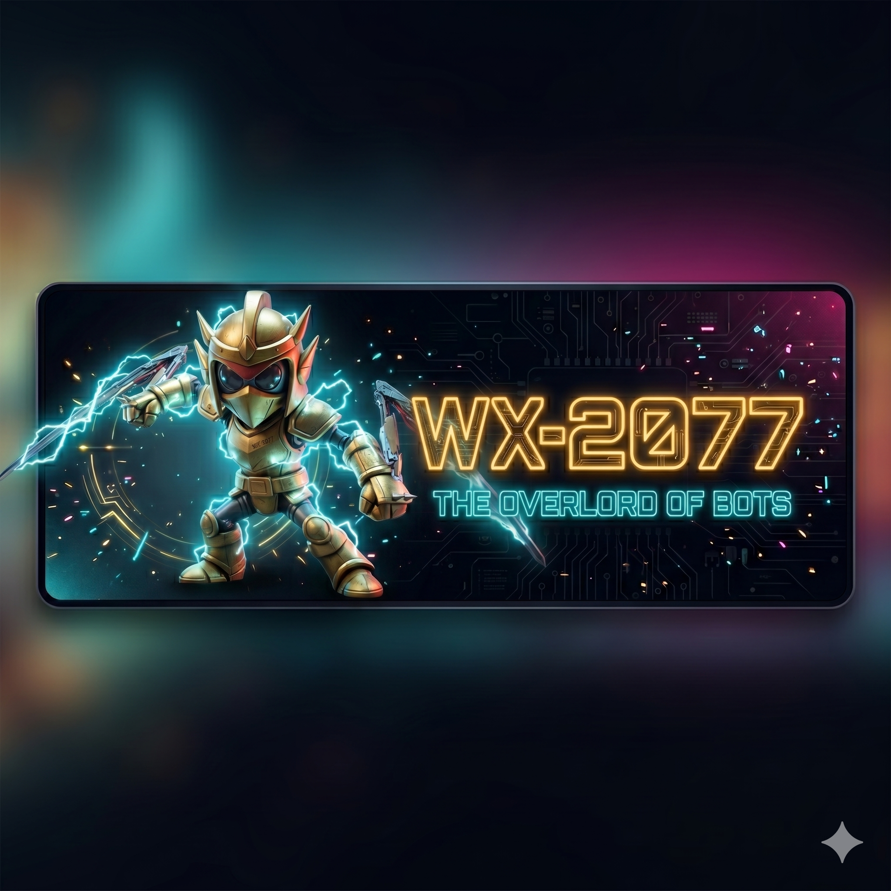

<p align="center">
  
</p>

<h1 align="center">⚡ WX-2077 — O Overlord dos Bots ⚡</h1>

<p align="center">
  <strong>O bot definitivo para Discord.</strong><br>
  Proteja, modere e gerencie seu servidor com poder absoluto.
</p>

<p align="center">
  <a href="https://discord.com/oauth2/authorize?client_id=1154902622189400074">
    
  </a>
  &nbsp;
  <a href="https://github.com/italotito/XW-2077">
    
  </a>
  &nbsp;
  
</p>

---

## 🤖 O que é o WX-2077?

O **WX-2077** é um bot multifuncional para Discord projetado para ser o guardião definitivo do seu servidor. Com moderação automática, verificação de membros, comandos de música e diversão — tudo em um único bot.

> *"Minions, obedeçam ao mestre!!!"* — WX-2077

---

## 🛡️ Funcionalidades Principais

### Segurança & Moderação
| Funcionalidade | Descrição |
|---|---|
| ✅ **Verificação Captcha** | Sistema automático para garantir que novos membros são humanos reais |
| 🚫 **Bloqueio Automático** | Detecta e bane links suspeitos e maliciosos em tempo real |
| ⚙️ **Moderação Manual** | Comandos de kick, ban, mute e warn para administradores |

### Música
| Funcionalidade | Descrição |
|---|---|
| 🎵 **Reprodução de Música** | Toque músicas via link ou nome diretamente no canal de voz |
| 📋 **Fila de Reprodução** | Gerencie a fila com skip, pause, stop e queue |
| 🔊 **Controle de Volume** | Ajuste o volume de 0 a 100 |

### Diversão
| Funcionalidade | Descrição |
|---|---|
| 😂 **Memes & Piadas** | Comandos para enviar memes e piadas aleatórias |
| 🎮 **Mini-jogos** | Cara ou coroa, pedra-papel-tesoura e mais |

---

## 📋 Comandos

### Gerais
```
/help              → Lista todos os comandos disponíveis
/ping              → Verifica se o bot está online
/avatar @usuário   → Mostra o avatar de um usuário
/userinfo @usuário → Exibe informações do perfil
```

### Música
```
/play <link/nome>  → Toca uma música no canal de voz
/pause             → Pausa a reprodução
/stop              → Para a música e limpa a fila
/skip              → Pula para a próxima faixa
/queue             → Lista as músicas na fila
/volume <0-100>    → Ajusta o volume
```

### Moderação
```
/kick @usuário [motivo]  → Expulsa um usuário
/ban @usuário [motivo]   → Bane um usuário
/mute @usuário [tempo]   → Silencia um usuário
/unmute @usuário         → Remove o silenciamento
/warn @usuário [motivo]  → Emite um aviso formal
```

### Diversão
```
/meme                          → Envia um meme aleatório
/joke                          → Conta uma piada
/coinflip                      → Cara ou coroa
/rps <pedra|papel|tesoura>     → Pedra, papel ou tesoura
```

---

## 🌐 Landing Page

Este repositório contém a **landing page oficial** do WX-2077, construída com HTML, CSS e JavaScript puro — sem frameworks.

### ✨ Destaques da Landing Page

- 🎨 **Design Cyberpunk Premium** — Dark mode com glassmorphism, gradientes neon e paleta cyan/magenta/gold
- ✨ **Partículas de Energia** — Sistema de partículas em canvas no hero section
- ⌨️ **Efeito de Digitação** — Subtítulo com animação de typing em loop
- 🤖 **Mascote Animado** — Robô levitando com sombra dinâmica
- 📱 **100% Responsivo** — Mobile-first com menu hamburger animado
- 🔍 **Busca de Comandos** — Filtro por categoria e busca por texto em tempo real
- 📖 **Tutorial Interativo** — Guia passo a passo com FAQ accordion
- 🎯 **Scroll Reveal** — Elementos aparecem suavemente ao scrollar
- ⚡ **Efeito de Relâmpago** — Flash sutil de lightning na tela
- ⬆️ **Back to Top** — Botão flutuante para voltar ao topo
- 🔢 **Contadores Animados** — Stats com números que incrementam ao visualizar

### 📁 Estrutura do Projeto

```
Landing-Page/
├── index.html        → Página principal (hero, features, stats)
├── comandos.html     → Lista de comandos com filtro
├── tutorial.html     → Tutorial + FAQ accordion
├── style.css         → Design system cyberpunk completo
├── script.js         → Interatividade (partículas, typing, etc.)
└── images/
    ├── logonova.png  → Logo do bot (nav + favicon)
    ├── WX-Full.png   → Mascote corpo inteiro (hero)
    ├── logo.png      → Logo original
    ├── wxLOGO.png    → Banner do logo
    └── ...           → Demais assets
```

### 🛠️ Tecnologias

<p>
  
  
  
  
</p>

- **HTML5** — Semântico com SEO otimizado
- **CSS3** — Custom Properties, Glassmorphism, Grid, Flexbox, animações
- **JavaScript** — Vanilla JS com Intersection Observer, Canvas API, DOM manipulation
- **Zero dependências** — Nenhum framework, nenhuma lib externa

### 🚀 Como Rodar Localmente

```bash
# Clone o repositório
git clone https://github.com/italotito/XW-2077/Landing-Page.git

# Abra no navegador
cd Landing-Page
start index.html        # Windows
open index.html          # macOS
xdg-open index.html      # Linux
```

> Não precisa de servidor local — é tudo estático!

---

## 🤝 Contribuindo

Contribuições são bem-vindas! Sinta-se livre para:

1. Fazer um **fork** do projeto
2. Criar uma **branch** para sua feature (`git checkout -b feature/minha-feature`)
3. **Commit** suas mudanças (`git commit -m 'Adiciona minha feature'`)
4. **Push** para a branch (`git push origin feature/minha-feature`)
5. Abrir um **Pull Request**

---

## 📜 Licença

Este projeto está sob a licença MIT. Veja o arquivo [LICENSE](LICENSE) para mais detalhes.

---

<p align="center">
  
  <br><br>
  <strong>WX-2077 — Follow Your Master!!!</strong>
  <br>
  <sub>Feito com ⚡ por <a href="https://github.com/italotito/XW-2077">Italo</a></sub>
</p>
